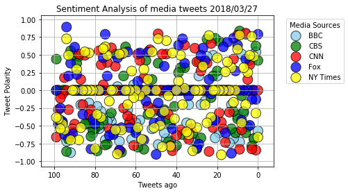

# Moody News - an analysis of the mood of the news from tweets from 5 media sources

### Observations:
<table>
<tr><th>Serial #</th><th>Observation</th></tr>
<tr><td>1</td><td>The compound mood of the news was generally negative.</td></tr>
<tr><td>2</td><td>BBC had the highest negative mood probably because it was world news.</td></tr>
<tr><td>3</td><td>Fox News, which is more right leaning had the least negative sentiment.</td></tr>
</table>

## First import the required libraries to read the tweets and initialize twitter API


```python
# Dependencies
import tweepy
import json
import twitterconfig

# Twitter API Keys
consumer_key = twitterconfig.consumer_key
consumer_secret = twitterconfig.consumer_secret
access_token = twitterconfig.access_token
access_token_secret = twitterconfig.access_token_secret

# Setup Tweepy API Authentication

# Setup Tweepy API Authentication
auth = tweepy.OAuthHandler(consumer_key, consumer_secret)
auth.set_access_token(access_token, access_token_secret)
api = tweepy.API(auth, parser=tweepy.parsers.JSONParser())
```

## Pick the media sources from which you want to read the tweets


```python
#Create a list of News Twitter Handles
news_handles = ['@BBCWorld', '@CBSNews', '@CNN', '@FoxNews', '@NYTimes']
```

## Import the Vader Analysis library for analyzing the mood


```python
# Import and Initialize Sentiment Analyzer
from vaderSentiment.vaderSentiment import SentimentIntensityAnalyzer
analyzer = SentimentIntensityAnalyzer()
```

## Create a list to store the tweet and polarity information


```python
news_tweets_sentiments = []
```

## Create function to hold tweet and polarity information for each row


```python
def createSentimentDict(handle,tweet_text,tweets_ago):
    senti_dict = {}
    senti_dict["News Handle"] = handle
    senti_dict["Tweet Text"] = tweet_text
    senti_dict["Tweets Ago"] = tweets_ago
    senti_dict["Compound Sentiment"] = analyzer.polarity_scores(tweet_text)["compound"]
    senti_dict["Positive Sentiment"] = analyzer.polarity_scores(tweet_text)["pos"]
    senti_dict["Negative Sentiment"] = analyzer.polarity_scores(tweet_text)["neg"]
    senti_dict["Neutral Sentiment"] = analyzer.polarity_scores(tweet_text)["neu"]
    return senti_dict
```

## Fetch 100 tweets from each handle and analyze each tweet


```python
for handle in news_handles:
    print()
    print("Analyzing tweets from "+handle)
    count = 0
    status_list = api.user_timeline(handle,count=100)
    for tweet in status_list:
        cur_senti_dict = createSentimentDict(handle,tweet["text"],count)
        news_tweets_sentiments.append(cur_senti_dict)
        count = count + 1
```

    
    Analyzing tweets from @BBCWorld
    
    Analyzing tweets from @CBSNews
    
    Analyzing tweets from @CNN
    
    Analyzing tweets from @FoxNews
    
    Analyzing tweets from @NYTimes
    

## Import libraries for pandas and plotting to store and plot the data


```python
#import Pandas and plotting libraries
import pandas as pd
import numpy as np
import matplotlib.pyplot as plt
import seaborn as sns
```

## Arrange the column order and create a dataframe


```python
column_names= ["News Handle","Tweet Text","Tweets Ago","Compound Sentiment","Positive Sentiment","Negative Sentiment","Neutral Sentiment"]
sentiments_df = pd.DataFrame(news_tweets_sentiments,columns=column_names)
sentiments_df.head()
```


<div>
<style>
    .dataframe thead tr:only-child th {
        text-align: right;
    }

    .dataframe thead th {
        text-align: left;
    }

    .dataframe tbody tr th {
        vertical-align: top;
    }
</style>
<table border="1" class="dataframe">
  <thead>
    <tr style="text-align: right;">
      <th></th>
      <th>News Handle</th>
      <th>Tweet Text</th>
      <th>Tweets Ago</th>
      <th>Compound Sentiment</th>
      <th>Positive Sentiment</th>
      <th>Negative Sentiment</th>
      <th>Neutral Sentiment</th>
    </tr>
  </thead>
  <tbody>
    <tr>
      <th>0</th>
      <td>@BBCWorld</td>
      <td>Kemerovo fire: Who are the victims in the Russ...</td>
      <td>0</td>
      <td>-0.5719</td>
      <td>0.000</td>
      <td>0.299</td>
      <td>0.701</td>
    </tr>
    <tr>
      <th>1</th>
      <td>@BBCWorld</td>
      <td>RT @BBC_HaveYourSay: Chicago superior? The phe...</td>
      <td>1</td>
      <td>0.5423</td>
      <td>0.241</td>
      <td>0.000</td>
      <td>0.759</td>
    </tr>
    <tr>
      <th>2</th>
      <td>@BBCWorld</td>
      <td>Kemerovo fire damage seen from inside gutted m...</td>
      <td>2</td>
      <td>-0.6808</td>
      <td>0.000</td>
      <td>0.444</td>
      <td>0.556</td>
    </tr>
    <tr>
      <th>3</th>
      <td>@BBCWorld</td>
      <td>Twenty million Indians apply for 100,000 railw...</td>
      <td>3</td>
      <td>0.0000</td>
      <td>0.000</td>
      <td>0.000</td>
      <td>1.000</td>
    </tr>
    <tr>
      <th>4</th>
      <td>@BBCWorld</td>
      <td>When is a diplomat really just a spy? https://...</td>
      <td>4</td>
      <td>0.0000</td>
      <td>0.000</td>
      <td>0.000</td>
      <td>1.000</td>
    </tr>
  </tbody>
</table>
</div>


## Get the date and store it as a string


```python
import datetime
today = datetime.date.today().strftime("%Y/%m/%d")
today
```


    '2018/03/27'


## Add the date as a column to the data


```python
sentiments_df["Date"] = today
```

## Store the data in a csv file


```python
sentiments_df.to_csv("news_sentiments.csv",index=False)
```

## Start plotting the data


```python
plt.title("Sentiment Analysis of media tweets " +today)
plt.xlabel("Tweets ago")
plt.ylabel("Tweet Polarity")
```


    Text(0,0.5,'Tweet Polarity')


## BBC


```python
bbc_sentiments_df = sentiments_df[sentiments_df["News Handle"] == "@BBCWorld"]
bbc_sentiments_df["Color"] = 'skyblue'
bbc_sentiments_df["Size"] = 200
plt.scatter(bbc_sentiments_df["Tweets Ago"],bbc_sentiments_df["Compound Sentiment"],c=bbc_sentiments_df["Color"],
                      s=bbc_sentiments_df["Size"],edgecolor='black',alpha=0.75)
```

    C:\Users\ravi_\AppData\Local\conda\conda\envs\PythonData\lib\site-packages\ipykernel_launcher.py:2: SettingWithCopyWarning: 
    A value is trying to be set on a copy of a slice from a DataFrame.
    Try using .loc[row_indexer,col_indexer] = value instead
    
    See the caveats in the documentation: http://pandas.pydata.org/pandas-docs/stable/indexing.html#indexing-view-versus-copy
      
    C:\Users\ravi_\AppData\Local\conda\conda\envs\PythonData\lib\site-packages\ipykernel_launcher.py:3: SettingWithCopyWarning: 
    A value is trying to be set on a copy of a slice from a DataFrame.
    Try using .loc[row_indexer,col_indexer] = value instead
    
    See the caveats in the documentation: http://pandas.pydata.org/pandas-docs/stable/indexing.html#indexing-view-versus-copy
      This is separate from the ipykernel package so we can avoid doing imports until
    


    <matplotlib.collections.PathCollection at 0x21ea0588f60>


## CBS


```python
cbs_sentiments_df = sentiments_df[sentiments_df["News Handle"] == "@CBSNews"]
cbs_sentiments_df["Color"] = 'green'
cbs_sentiments_df["Size"] = 200
plt.scatter(cbs_sentiments_df["Tweets Ago"],cbs_sentiments_df["Compound Sentiment"],c=cbs_sentiments_df["Color"],
                      s=cbs_sentiments_df["Size"],edgecolor='black',alpha=0.75)
```

    C:\Users\ravi_\AppData\Local\conda\conda\envs\PythonData\lib\site-packages\ipykernel_launcher.py:2: SettingWithCopyWarning: 
    A value is trying to be set on a copy of a slice from a DataFrame.
    Try using .loc[row_indexer,col_indexer] = value instead
    
    See the caveats in the documentation: http://pandas.pydata.org/pandas-docs/stable/indexing.html#indexing-view-versus-copy
      
    C:\Users\ravi_\AppData\Local\conda\conda\envs\PythonData\lib\site-packages\ipykernel_launcher.py:3: SettingWithCopyWarning: 
    A value is trying to be set on a copy of a slice from a DataFrame.
    Try using .loc[row_indexer,col_indexer] = value instead
    
    See the caveats in the documentation: http://pandas.pydata.org/pandas-docs/stable/indexing.html#indexing-view-versus-copy
      This is separate from the ipykernel package so we can avoid doing imports until
    


    <matplotlib.collections.PathCollection at 0x21e96a1c278>


## CNN


```python
cnn_sentiments_df = sentiments_df[sentiments_df["News Handle"] == "@CNN"]
cnn_sentiments_df["Color"] = 'red'
cnn_sentiments_df["Size"] = 200
plt.scatter(cnn_sentiments_df["Tweets Ago"],cnn_sentiments_df["Compound Sentiment"],c=cnn_sentiments_df["Color"],
                      s=cnn_sentiments_df["Size"],edgecolor='black',alpha=0.75)
```

    C:\Users\ravi_\AppData\Local\conda\conda\envs\PythonData\lib\site-packages\ipykernel_launcher.py:2: SettingWithCopyWarning: 
    A value is trying to be set on a copy of a slice from a DataFrame.
    Try using .loc[row_indexer,col_indexer] = value instead
    
    See the caveats in the documentation: http://pandas.pydata.org/pandas-docs/stable/indexing.html#indexing-view-versus-copy
      
    C:\Users\ravi_\AppData\Local\conda\conda\envs\PythonData\lib\site-packages\ipykernel_launcher.py:3: SettingWithCopyWarning: 
    A value is trying to be set on a copy of a slice from a DataFrame.
    Try using .loc[row_indexer,col_indexer] = value instead
    
    See the caveats in the documentation: http://pandas.pydata.org/pandas-docs/stable/indexing.html#indexing-view-versus-copy
      This is separate from the ipykernel package so we can avoid doing imports until
    


    <matplotlib.collections.PathCollection at 0x21ea056b7b8>


## Fox News


```python
fox_sentiments_df = sentiments_df[sentiments_df["News Handle"] == "@FoxNews"]
fox_sentiments_df["Color"] = 'blue'
fox_sentiments_df["Size"] = 200
plt.scatter(fox_sentiments_df["Tweets Ago"],fox_sentiments_df["Compound Sentiment"],c=fox_sentiments_df["Color"],
                      s=fox_sentiments_df["Size"],edgecolor='black',alpha=0.75)
```

    C:\Users\ravi_\AppData\Local\conda\conda\envs\PythonData\lib\site-packages\ipykernel_launcher.py:2: SettingWithCopyWarning: 
    A value is trying to be set on a copy of a slice from a DataFrame.
    Try using .loc[row_indexer,col_indexer] = value instead
    
    See the caveats in the documentation: http://pandas.pydata.org/pandas-docs/stable/indexing.html#indexing-view-versus-copy
      
    C:\Users\ravi_\AppData\Local\conda\conda\envs\PythonData\lib\site-packages\ipykernel_launcher.py:3: SettingWithCopyWarning: 
    A value is trying to be set on a copy of a slice from a DataFrame.
    Try using .loc[row_indexer,col_indexer] = value instead
    
    See the caveats in the documentation: http://pandas.pydata.org/pandas-docs/stable/indexing.html#indexing-view-versus-copy
      This is separate from the ipykernel package so we can avoid doing imports until
    


    <matplotlib.collections.PathCollection at 0x21e9e92ee10>


## NY Times


```python
nyt_sentiments_df = sentiments_df[sentiments_df["News Handle"] == "@NYTimes"]
nyt_sentiments_df["Color"] = 'yellow'
nyt_sentiments_df["Size"] = 200
plt.scatter(nyt_sentiments_df["Tweets Ago"],nyt_sentiments_df["Compound Sentiment"],c=nyt_sentiments_df["Color"],
                      s=nyt_sentiments_df["Size"],edgecolor='black',alpha=0.75)
```

    C:\Users\ravi_\AppData\Local\conda\conda\envs\PythonData\lib\site-packages\ipykernel_launcher.py:2: SettingWithCopyWarning: 
    A value is trying to be set on a copy of a slice from a DataFrame.
    Try using .loc[row_indexer,col_indexer] = value instead
    
    See the caveats in the documentation: http://pandas.pydata.org/pandas-docs/stable/indexing.html#indexing-view-versus-copy
      
    C:\Users\ravi_\AppData\Local\conda\conda\envs\PythonData\lib\site-packages\ipykernel_launcher.py:3: SettingWithCopyWarning: 
    A value is trying to be set on a copy of a slice from a DataFrame.
    Try using .loc[row_indexer,col_indexer] = value instead
    
    See the caveats in the documentation: http://pandas.pydata.org/pandas-docs/stable/indexing.html#indexing-view-versus-copy
      This is separate from the ipykernel package so we can avoid doing imports until
    


    <matplotlib.collections.PathCollection at 0x21e9e938400>


## Plot and show the scatter plot and save the image


```python


plt.legend(('BBC', 'CBS','CNN', 'Fox','NY Times'),title='Media Sources',bbox_to_anchor=(1.04,1), loc="upper left")
plt.grid()
plt.gray()
plt.gca().invert_xaxis()
plt.savefig("newssentiment.png")
plt.show()
```





## Get the mean of the compound sentiment to plot as a bar graph


```python
sentiments_mean_df = pd.DataFrame(sentiments_df.groupby(["News Handle"]).mean())
sentiments_mean_df
```


<div>
<style>
    .dataframe thead tr:only-child th {
        text-align: right;
    }

    .dataframe thead th {
        text-align: left;
    }

    .dataframe tbody tr th {
        vertical-align: top;
    }
</style>
<table border="1" class="dataframe">
  <thead>
    <tr style="text-align: right;">
      <th></th>
      <th>Tweets Ago</th>
      <th>Compound Sentiment</th>
      <th>Positive Sentiment</th>
      <th>Negative Sentiment</th>
      <th>Neutral Sentiment</th>
    </tr>
    <tr>
      <th>News Handle</th>
      <th></th>
      <th></th>
      <th></th>
      <th></th>
      <th></th>
    </tr>
  </thead>
  <tbody>
    <tr>
      <th>@BBCWorld</th>
      <td>49.5</td>
      <td>-0.219993</td>
      <td>0.03087</td>
      <td>0.14351</td>
      <td>0.82561</td>
    </tr>
    <tr>
      <th>@CBSNews</th>
      <td>49.5</td>
      <td>-0.116549</td>
      <td>0.04711</td>
      <td>0.10100</td>
      <td>0.85188</td>
    </tr>
    <tr>
      <th>@CNN</th>
      <td>49.5</td>
      <td>-0.060657</td>
      <td>0.05848</td>
      <td>0.09262</td>
      <td>0.84889</td>
    </tr>
    <tr>
      <th>@FoxNews</th>
      <td>49.5</td>
      <td>-0.037896</td>
      <td>0.07141</td>
      <td>0.09072</td>
      <td>0.83785</td>
    </tr>
    <tr>
      <th>@NYTimes</th>
      <td>49.5</td>
      <td>-0.049374</td>
      <td>0.07762</td>
      <td>0.08824</td>
      <td>0.83409</td>
    </tr>
  </tbody>
</table>
</div>


## Plot it and save the figure


```python
colors=('skyblue','green','red','blue','yellow')
plt.bar(('BBC', 'CBS','CNN', 'Fox','NY Times'),sentiments_mean_df["Compound Sentiment"],color=colors)
plt.ylabel("Tweet Polarity")
plt.title(f"Overall Media Sentiment Based on Twitter ({today})")
plt.savefig("overallnewssentiment.png")
plt.show()
```


### Bonus - HTML to hide warnings in the Jupyter notebook:


```python
from IPython.display import HTML
HTML('''<script>
code_show_err=false; 
function code_toggle_err() {
 if (code_show_err){
 $('div.output_stderr').hide();
 } else {
 $('div.output_stderr').show();
 }
 code_show_err = !code_show_err
} 
$( document ).ready(code_toggle_err);
</script>
To toggle on/off output_stderr, click <a href="javascript:code_toggle_err()">here</a>.''')
```


<script>
code_show_err=false; 
function code_toggle_err() {
 if (code_show_err){
 $('div.output_stderr').hide();
 } else {
 $('div.output_stderr').show();
 }
 code_show_err = !code_show_err
} 
$( document ).ready(code_toggle_err);
</script>
To toggle on/off output_stderr, click <a href="javascript:code_toggle_err()">here</a>.


